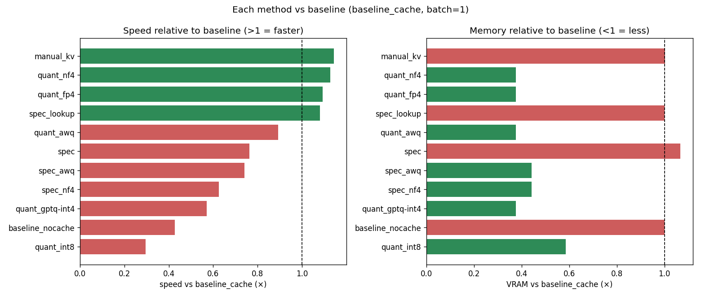
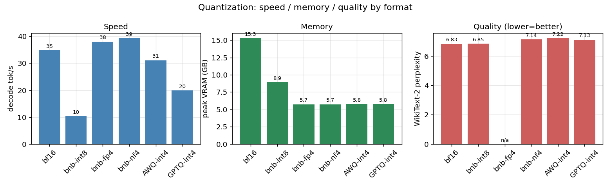
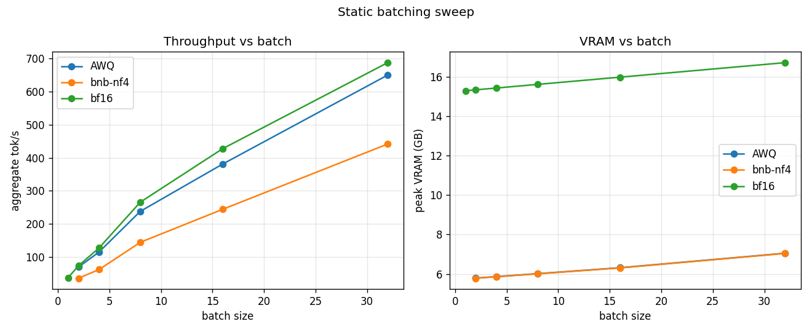
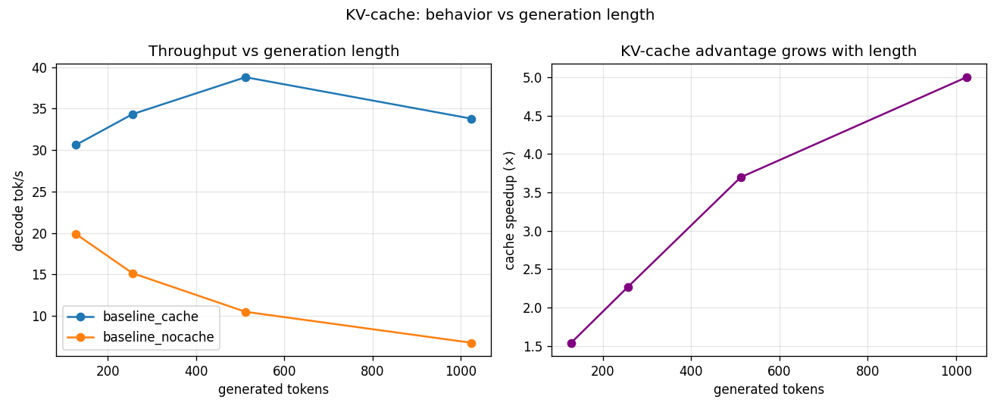
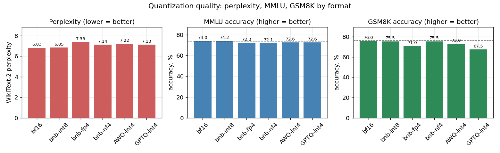

# llm-inference

Benchmarking LLM inference optimizations on a single consumer GPU (RTX 3090 24GB, WSL2 Ubuntu).

Starting from vanilla HuggingFace `generate()`, the project measures how each optimization method changes **speed, memory and (for lossy methods) quality**, always against the same bf16 + KV-cache baseline:

| method | variants measured |
| --- | --- |
| KV-cache | off vs on, manual prefill+decode loop, generation-length sweep 128–1024 |
| Weight quantization | bitsandbytes int8 / nf4 / fp4, AWQ-int4, GPTQ-int4 (Triton **and** Marlin kernels) |
| Speculative decoding | 0.5B draft model (UAD on 7B), prompt-lookup, quant + spec combinations |
| Static batching | batch size 1, 2, 4, 8, 16, 32 × {bf16, nf4, AWQ} |
| Quality (7B only) | MMLU, GSM8K-CoT, WikiText-2 perplexity |

Models: `Qwen2.5-1.5B-Instruct` (dev), `Qwen2.5-7B-Instruct` (main), `Qwen2.5-3B-Instruct` (spec cross-check), `Qwen2.5-0.5B-Instruct` (draft).
Prompts: 40 MT-Bench questions × 3 repeats, 256 new tokens, fixed length (EOS ignored), greedy.

This is the experimental part of a master's thesis on inference optimization. Design rationale lives in [`EXPERIMENT_PLAN.md`](EXPERIMENT_PLAN.md), and running notes and conclusions in [`WORKLOG.md`](WORKLOG.md) (both in Russian).

## Key findings

On Qwen2.5-7B, single stream, relative to bf16 + KV-cache:



- **KV-cache always wins, and the gain grows with length:** ×1.5 at 128 tokens → ×2.3 at 256 → ×5.0 at 1024 tokens.
- **Whether 4-bit quantization is faster depends on the kernel.** With bitsandbytes or Triton, 4-bit only saves memory (nf4 39 vs bf16 35 tok/s). With **Marlin** kernels, AWQ/GPTQ-int4 reach **60–61 tok/s, ×1.7 faster** than bf16, and use **×2.7 less VRAM** (5.6 vs 15.3 GB). bnb-int8 is the slowest configuration everywhere (~10 tok/s).
- **4-bit quality loss is small.** Perplexity rises by about 0.3 and MMLU drops 1–2 points. GPTQ-int4 is noticeably worse on GSM8K (0.675 vs 0.76). int8 has no measurable quality loss.
- **Batching is the biggest throughput lever:** 7B bf16 goes from 37 to 688 tok/s at batch 32 with near-linear scaling. With 4-bit weights, batch 32 fits in 7 GB.
- **Speculative decoding with a draft model doesn't pay off at ≤7B on 3090 + HF** (×0.62–0.76), even though each step accepts a block of about 3 tokens. Draft and framework overhead outweigh the saved target passes. Prompt-lookup is roughly break-even. Lossless output was verified in fp32.
- **Gains don't stack:** quant + spec is slower than either method alone.

## Results

### Qwen2.5-7B-Instruct, batch = 1

| config | decode tok/s | TTFT ms | peak VRAM GB | MMLU | GSM8K | PPL |
| --- | ---: | ---: | ---: | ---: | ---: | ---: |
| bf16, no cache ¹ | 15 ± 1 | 35 | 15.3 | 0.740 | 0.760 | 6.83 |
| **bf16 + KV-cache (baseline)** | **35 ± 3** | **38** | **15.3** | **0.740** | **0.760** | **6.83** |
| manual KV loop | 40 ± 1 | 37 | 15.3 | — | — | — |
| bnb-int8 | 10 ± 1 | 125 | 8.9 | 0.742 | 0.755 | 6.85 |
| bnb-nf4 | 39 ± 4 | 62 | 5.7 | 0.721 | 0.755 | 7.14 |
| bnb-fp4 | 38 ± 4 | 63 | 5.7 | 0.723 | 0.710 | 7.38 |
| AWQ-int4 (Triton) | 31 ± 3 | 58 | 5.8 | 0.726 | 0.730 | 7.22 |
| GPTQ-int4 (Triton) | 20 ± 0 | 61 | 5.8 | 0.726 | 0.675 | 7.13 |
| **AWQ-int4 (Marlin)** | **60 ± 4** | 32 | **5.6** | 0.726 | 0.730 | 7.22 |
| **GPTQ-int4 (Marlin)** | **61 ± 5** | 35 | **5.6** | 0.726 | 0.675 | 7.13 |
| spec, 0.5B draft | 27 ± 5 | 160 | 16.3 | = baseline | | |
| spec, prompt-lookup | 38 ± 7 | 49 | 15.3 | = baseline | | |
| spec + AWQ target | 26 ± 4 | 187 | 6.7 | = AWQ | | |
| spec + nf4 target | 22 ± 5 | 189 | 6.8 | = nf4 | | |

¹ no-cache on 7B uses a reduced scope (10 prompts × 1 repeat), since it scales quadratically with length.

### Batching throughput, tok/s (7B / 1.5B)

| batch | bf16 | AWQ | nf4 |
| ---: | ---: | ---: | ---: |
| 1 | 37 / 59 | — | — |
| 2 | 73 / 115 | 69 / 84 | 35 / 76 |
| 4 | 127 / 216 | 115 / 142 | 62 / 125 |
| 8 | 266 / 450 | 238 / 350 | 144 / 269 |
| 16 | 428 / 769 | 381 / 544 | 244 / 460 |
| 32 | 688 / 1352 | 650 / 1069 | 442 / 913 |

Full tables, including 1.5B and 3B: `results/<model>/summary_table.{csv,json}`.

<table>
<tr>
<td></td>
<td></td>
</tr>
<tr>
<td></td>
<td></td>
</tr>
</table>

More plots, including Pareto fronts and spec variants: [`results/qwen7b/plots/`](results/qwen7b/plots/) · [`results/qwen1.5b/plots/`](results/qwen1.5b/plots/).

## Setup

```bash
uv sync
source .venv/bin/activate
```

Requires a CUDA GPU. torch is pinned to the `pytorch-cu128` index (see [`pyproject.toml`](pyproject.toml)). The Marlin kernels are compiled at first use and need the CUDA toolkit:

```bash
export CUDA_HOME=/usr/local/cuda-12.8
export PATH=$CUDA_HOME/bin:$PATH
```

Models are downloaded from the HuggingFace Hub on first run. 7B bf16 is about 15 GB.

## Usage

Every benchmark script shares these flags: `--model`, `--limit` (default 5, max 80), `--repeats`, `--max-new-tokens` (default 256), `--fixed-length`, `--out-dir`, `--quality` (WikiText-2 perplexity), `--dump-text`.

```bash
# baseline: vanilla generate(), with or without KV-cache
python scripts/benchmark_baseline.py --limit 40 --repeats 3 --fixed-length
python scripts/benchmark_baseline.py --limit 40 --no-cache

# explicit prefill + decode loop with DynamicCache (also reports KV-cache size)
python scripts/manual_kv_loop.py --limit 40

# quantization: int8 | nf4 | fp4 | awq | gptq-int4 | gptq-int8, optionally on Marlin kernels
python scripts/benchmark_quant.py --quant awq --marlin --limit 40 --fixed-length

# speculative decoding: draft model, optionally with a quantized target, or prompt-lookup
python scripts/benchmark_spec.py --model Qwen/Qwen2.5-7B-Instruct --draft-model Qwen/Qwen2.5-0.5B-Instruct
python scripts/benchmark_spec.py --prompt-lookup-tokens 10
python scripts/check_fidelity.py --dtype float32      # spec output == greedy target

# static batching (left-padded)
python scripts/benchmark_batch.py --batch-size 16 --quant nf4 --fixed-length

# quality: MMLU / GSM8K / perplexity
python scripts/eval_quality.py --model Qwen/Qwen2.5-7B-Instruct --quant awq
```

### Full experiment

`run_matrix.py` runs every config in its own process, so each run gets a clean `max_memory_allocated()`. Then `aggregate.py` and `plots.py` build the tables and figures:

```bash
bash scripts/run_all.sh            # 1.5B + 7B: speed, batch, quality → tables → plots
bash scripts/run_marlin.sh         # re-measure AWQ/GPTQ on Marlin kernels (~35 min)

python scripts/run_matrix.py --model Qwen/Qwen2.5-7B-Instruct --only baseline_cache spec --out-dir results/qwen7b
python scripts/aggregate.py --results-dir results/qwen7b --out results/qwen7b/summary_table
python scripts/plots.py --results-dir results/qwen7b --out-dir results/qwen7b/plots
python scripts/plots_methods.py --results-dir results/qwen7b --length-dir results/length_sweep/qwen7b
```

Each run writes a per-prompt `<run_id>.jsonl` (gitignored) and a per-run summary `<run_id>.json` (committed). The summary includes mean ± std over repeats, generation settings, the git commit, and GPU temperature and clocks.

## Layout

```
data/mt_bench/question.jsonl     80 MT-Bench prompts
scripts/
  benchmark_baseline.py          vanilla generate(), --no-cache
  manual_kv_loop.py              explicit prefill + decode with DynamicCache
  benchmark_quant.py             bnb int8/nf4/fp4, AWQ/GPTQ (--marlin)
  benchmark_spec.py              draft-model / prompt-lookup speculative decoding
  benchmark_batch.py             static batching, left-pad
  check_fidelity.py              spec output vs greedy target
  eval_quality.py                MMLU / GSM8K / perplexity via lm-eval
  run_matrix.py                  config-matrix driver, one process per config
  aggregate.py                   summary JSONs → summary_table.{csv,json}
  plots.py, plots_methods.py     figures
  run_*.sh, resume_7b.sh         launchers for long runs
  cli.py data.py modeling.py timing.py decode.py runner.py
  summary.py quality.py env.py plotstyle.py   shared helpers
results/
  qwen1.5b/ qwen3b/ qwen7b/      summary JSONs, summary_table, plots/
  length_sweep/                  KV-cache on/off at 128–1024 tokens
EXPERIMENT_PLAN.md               experiment design (RU)
WORKLOG.md                       progress log and conclusions (RU)
```
